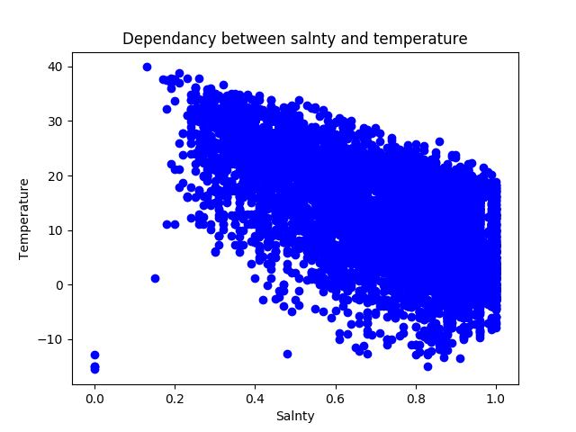
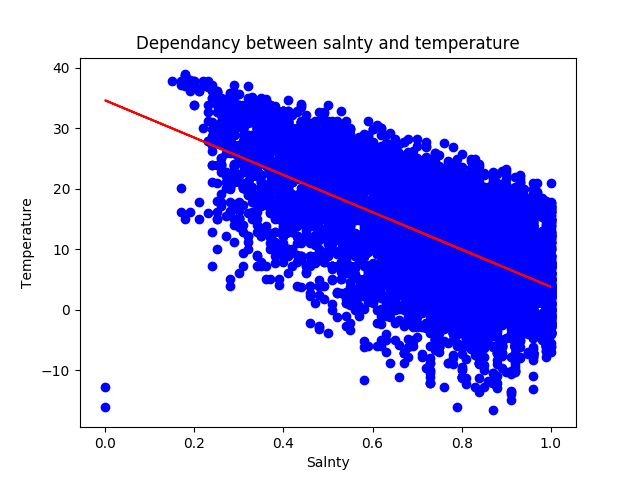

# sklearn_linear_regression
Sklearn linear regression example with Kaggle dataset

* Installation
  ```
   $ pip install -r requirements.txt
  ```
* Run 
  ```
  $ python linear_sklearn.py
  ```
  
 ### Description
  The Dataset with the dependency between weather and humanity.
  The linear regression algorythm tries to find the best approcsimation for that dependency
### Weacher distribution

### Predicted line

